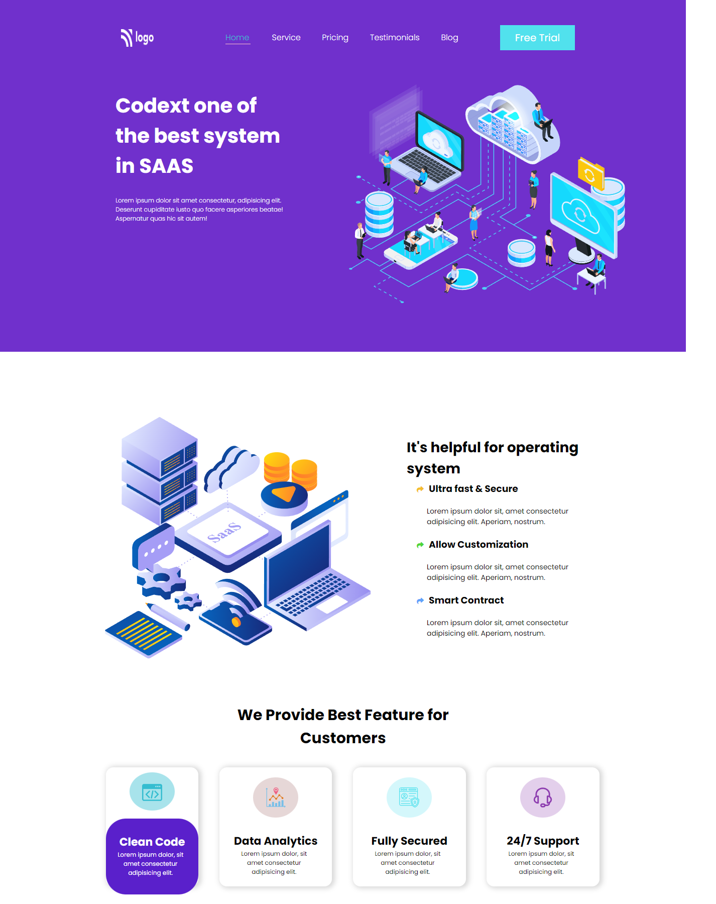

# SAAS Landing page    
  
 This is a `mobile responsive` landing page made for learning purposes using `CORE CSS` and `HTML`.  This project is an assignment to Full Stack Javascript Modern Web Development Bootcamp 1.0 by  [ineuron.ai](https://ineuron.ai/)  

Made by - **Robin Khilery**

Duration : **7 Hours**

***
 
## :clipboard: Learnings
Explored `CSS flexbox` ,get command over different flexbox properties  of container and items  and also get to  learn  in depth understanding of `position` property. 

## Deployed Link
 [click here to see deployed version](https://saas-home-page-link.netlify.app "Click to Visit Link") 

## Screenshots

 